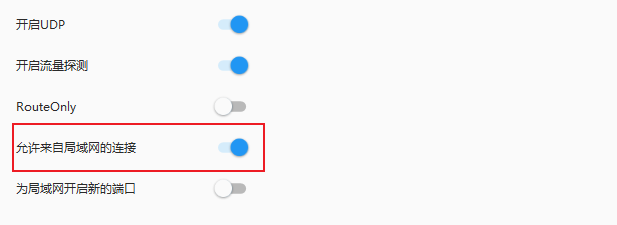

# WSL2 下配置代理

## 1. 修改防火墙规则

开放系统对 WSL2 的局域网访问权限（无毒无害）  
以管理员权限打开 powershell，输入如下命令，

```
cd C:\WINDOWS\system32
New-NetFirewallRule -DisplayName "WSL" -Direction Inbound  -InterfaceAlias "vEthernet (WSL)"  -Action Allow
```

允许代理软件通过防火墙  
在代理软件中打开局域网连接，如下图，

  

  在`资源监视器>网络`中查看监听代理端口的进程名，我的代理端口是10086，如下图，

  

  允许该进程通过防火墙，

  

## 2. 在 WSL2 中配置代理
新建 `proxy.sh`，内容如下：

```sh
hostip=$(cat /etc/resolv.conf | grep nameserver | awk '{ print $2 }')
wslip=$(hostname -I | awk '{print $1}')
port=7890
 
PROXY_HTTP="http://${hostip}:${port}"
 
set_proxy(){
  export http_proxy="${PROXY_HTTP}"
  export HTTP_PROXY="${PROXY_HTTP}"
 
  export https_proxy="${PROXY_HTTP}"
  export HTTPS_proxy="${PROXY_HTTP}"
 
  export ALL_PROXY="${PROXY_SOCKS5}"
  export all_proxy=${PROXY_SOCKS5}
 
  git config --global http.https://github.com.proxy ${PROXY_HTTP}
  git config --global https.https://github.com.proxy ${PROXY_HTTP}
 
  echo "Proxy has been opened."
}
 
unset_proxy(){
  unset http_proxy
  unset HTTP_PROXY
  unset https_proxy
  unset HTTPS_PROXY
  unset ALL_PROXY
  unset all_proxy
  git config --global --unset http.https://github.com.proxy
  git config --global --unset https.https://github.com.proxy
 
  echo "Proxy has been closed."
}
 
test_setting(){
  echo "Host IP:" ${hostip}
  echo "WSL IP:" ${wslip}
  echo "Try to connect to Google..."
  resp=$(curl -I -s --connect-timeout 5 -m 5 -w "%{http_code}" -o /dev/null www.google.com)
  if [ ${resp} = 200 ]; then
    echo "Proxy setup succeeded!"
  else
    echo "Proxy setup failed!"
  fi
}
 
if [ "$1" = "set" ]
then
  set_proxy
 
elif [ "$1" = "unset" ]
then
  unset_proxy
 
elif [ "$1" = "test" ]
then
  test_setting
else
  echo "Unsupported arguments."
fi
```

之后就可以通过如下命令设置代理：
```sh
source proxy.sh set     # 打开代理
source proxy.sh unset   # 关闭代理
source proxy.sh test    # 测试代理
```

在 `.zshrc` 中添加如下命令：`alias proxy="source proxy.sh"`  
之后就可以通过如下命令设置代理：

```sh
proxy set               # 打开代理
proxy unset             # 关闭代理
proxy test              # 测试代理
```