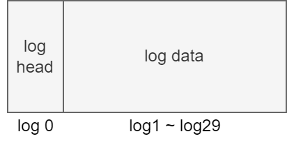

## disk (磁盘)

### 布局

**sector**: 磁盘存取的最小单位。在xv6中为1kb

**block**: 文件系统存取的最小单位，为sector的任意整数倍。在xv6中为1kb


- boot block: 启动操作系统的代码
- super block: 描述文件系统信息
- log blocks: 日志层
- inode blocks: 存放所有inode
- bitmap block: 记录data block是否空闲
- data blocks: 存储文件和目录的内容

### supber block

```c
// kernel/fs.h
struct superblock {
  uint magic;        // Must be FSMAGIC
  uint size;         // Size of file system image (blocks)
  uint nblocks;      // Number of data blocks
  uint ninodes;      // Number of inodes.
  uint nlog;         // Number of log blocks
  uint logstart;     // Block number of first log block
  uint inodestart;   // Block number of first inode block
  uint bmapstart;    // Block number of first free map block
};
```

```c
#define FSSIZE       2000  // size of file system in blocks
#define MAXOPBLOCKS  10  // max # of blocks any FS op writes
#define LOGSIZE      (MAXOPBLOCKS*3)  // max data blocks in on-disk log
#define NINODES 200
```

```c
// kernel/fs.c
// there should be one superblock per disk device, 
// but we run with only one device
struct superblock sb; 

// Init fs
void
fsinit(int dev) {
  readsb(dev, &sb);
  if(sb.magic != FSMAGIC)
    panic("invalid file system");
  initlog(dev, &sb);
}

// Read the super block.
static void
readsb(int dev, struct superblock *sb)
{
  struct buf *bp;

  bp = bread(dev, 1);
  memmove(sb, bp->data, sizeof(*sb));
  brelse(bp);
}
```


## buffer cache

### struct buf

```c
// kernel/buf.h
struct buf {
  int valid;   // has data been read from disk?
  int disk;    // does disk "own" buf?
  uint dev;
  uint blockno;
  struct sleeplock lock;
  uint refcnt;      // 
  struct buf *prev; // LRU cache list
  struct buf *next;
  uchar data[BSIZE];
};
```

### bcache

```c
// kernel/bio.c
struct {
  struct spinlock lock;
  struct buf buf[NBUF];

  // Linked list of all buffers, through prev/next.
  // Sorted by how recently the buffer was used.
  // head.next is most recent, head.prev is least.
  // 双向循环链表
  struct buf head;
} bcache;
```

### bread()

```c
// kernel/bio.c
struct buf*
bread(uint dev, uint blockno)
{
  struct buf *b;

  b = bget(dev, blockno);
  if(!b->valid) {
    virtio_disk_rw(b, 0);
    b->valid = 1;
  }
  return b;
}
```

### bget()

```c
// kernel/bio.c
static struct buf*
bget(uint dev, uint blockno)
{
  struct buf *b;

  acquire(&bcache.lock);

  // Is the block already cached?
  for(b = bcache.head.next; b != &bcache.head; b = b->next){
    if(b->dev == dev && b->blockno == blockno){
      b->refcnt++;
      release(&bcache.lock);
      acquiresleep(&b->lock);
      return b;
    }
  }

  // Not cached.
  // Recycle the least recently used (LRU) unused buffer.
  // 逆序遍历
  for(b = bcache.head.prev; b != &bcache.head; b = b->prev){
    if(b->refcnt == 0) {
      b->dev = dev;
      b->blockno = blockno;
      // 还未从磁盘读取数据
      b->valid = 0;
      b->refcnt = 1;
      release(&bcache.lock);
      acquiresleep(&b->lock);
      return b;
    }
  }
  panic("bget: no buffers");
}
```

### brelese()

```c
// kernel/bio.c
void
brelse(struct buf *b)
{
  if(!holdingsleep(&b->lock))
    panic("brelse");

  releasesleep(&b->lock);

  acquire(&bcache.lock);
  b->refcnt--;
  if (b->refcnt == 0) {
    // no one is waiting for it.
    // b移动到链表表头
    b->next->prev = b->prev;
    b->prev->next = b->next;
    b->next = bcache.head.next;
    b->prev = &bcache.head;
    bcache.head.next->prev = b;
    bcache.head.next = b;
  }
  
  release(&bcache.lock);
}
```

## logging

### why

- case 1

  ```c
  // kernel/sysfile.c
  static struct inode*
  create(char *path, short type, short major, short minor)
  {
  ...
    if((ip = ialloc(dp->dev, type)) == 0){
      iunlockput(dp);
      return 0;
    }
    <- crashed here, what will happen
  ...
  }
  ```

  crash会导致我们会丢失这个inode

- case 2

  在为文件分配block时

  1. 从 data blocks 中找到一块空闲 block
  2. 将该 block number 写入到文件的 inode 中
  3. 在bitmap中标记该block已使用

  如果2，3之间 crash 会怎么样

  crash 可能会导致这个 block 被分配给多个文件

  **fatal !**

### what

buffer cache 之上的一种机制，用来保证系统调用的原子性，同时能够在系统 crash 之后进行 Fast Recovery

### how

```c
// kernel/log.c
struct logheader {
  int n;
  int block[LOGSIZE];
};

struct log {
  struct spinlock lock;
  int start;       // start of log blocks
  int size;         // number of log blocks
  int outstanding; // how many FS sys calls are executing.
  int committing;  // in commit(), please wait.
  int dev;
  struct logheader lh;
};
struct log log;
```



### log 实现

- log write4

  当需要更新 inode block 或 bitmap block 或 data block 时，我们并不直接写入到磁盘对应的位置，而是记录一条 log 到磁盘的 log 分区

  ```c
  // kernel/log.c
  void
  log_write(struct buf *b)
  {
    int i;
  
    acquire(&log.lock);
    if (log.lh.n >= LOGSIZE || log.lh.n >= log.size - 1)
      panic("too big a transaction");
    if (log.outstanding < 1)
      panic("log_write outside of trans");
    // 要写入的 block number 已存在
    for (i = 0; i < log.lh.n; i++) {
      if (log.lh.block[i] == b->blockno)   // log absorption
        break;
    }
    log.lh.block[i] = b->blockno;
    if (i == log.lh.n) {  // Add new block to log?
      bpin(b);
      log.lh.n++;
    }
    // i != log.lh.n
    // log 已存在并且未 commit，nothing to do
    release(&log.lock);
  }
  ```

- commit

  ```c
  // kernel/log.c
  static void
  commit()
  {
    if (log.lh.n > 0) {
      write_log();     // Write modified blocks from cache to log
      write_head();    // Write header to disk -- the real commit
      install_trans(0); // Now install writes to home locations
      log.lh.n = 0;
      write_head();    // Erase the transaction from the log
    }
  }
  ```

  对单个 disk block 的读写具有原子性

  commit 可保证系统调用的原子性

  ```c
  // kernel/log.c
  static void
  write_log(void)
  {
    int tail;
  
    for (tail = 0; tail < log.lh.n; tail++) {
      struct buf *to = bread(log.dev, log.start+tail+1); // log block
      struct buf *from = bread(log.dev, log.lh.block[tail]); // cache block
      // 将 log 中记录的缓冲块号的缓冲块复制到 log 缓冲块
      memmove(to->data, from->data, BSIZE);
      // 将 log 缓冲块写出到磁盘
      bwrite(to);  // write the log
      brelse(from);
      brelse(to);
    }
  }
  ```

  ```c
  // kernel/log.c
  static void
  write_head(void)
  {
    struct buf *buf = bread(log.dev, log.start);
    struct logheader *hb = (struct logheader *) (buf->data);
    int i;
    // 将内存中的 logheader 复制到 log head 的缓冲块
    hb->n = log.lh.n;
    for (i = 0; i < log.lh.n; i++) {
      hb->block[i] = log.lh.block[i];
    }
    // 将 log head 的缓冲块写出到磁盘
    bwrite(buf);
    brelse(buf);
  }
  ```

- install trans

  ```c
  // kernel/log.c
  static void
  install_trans(int recovering)
  {
    int tail;
  
    for (tail = 0; tail < log.lh.n; tail++) {
      struct buf *lbuf = bread(log.dev, log.start+tail+1); // read log block
      struct buf *dbuf = bread(log.dev, log.lh.block[tail]); // read dst
      memmove(dbuf->data, lbuf->data, BSIZE);  // copy block to dst
      bwrite(dbuf);  // write dst to disk
      if(recovering == 0)
        bunpin(dbuf);
      brelse(lbuf);
      brelse(dbuf);
    }
  }
  ```

- clean log

  ```c
  // kernel/log.c
  static void
  commit()
  {
  ...
    log.lh.n = 0;
    write_head();    // Erase the transaction from the log
  }
  ```

- recovery

  ```c
  // kernel/log.c
  static void
  recover_from_log(void)
  {
    read_head();
    install_trans(1); // if committed, copy from log to disk
    log.lh.n = 0;
    write_head(); // clear the log
  }
  ```

### usage

```c
uint64
sys_open()
{
...
  // 合法性检查
  begin_op();
  ...
  log_write();
  ...
  log_write();
  ...
  end_op();
...
}
```

```c
// kernel/log.c
void
begin_op(void)
{
  acquire(&log.lock);
  while(1){
    // 有系统调用正在 commit
    if(log.committing){
      sleep(&log, &log.lock);
      // 可能超出 log 大小限制
    } else if(log.lh.n + (log.outstanding+1)*MAXOPBLOCKS > LOGSIZE){
      // this op might exhaust log space; wait for commit.
      sleep(&log, &log.lock);
    } else {
      log.outstanding += 1;
      release(&log.lock);
      break;
    }
  }
}
```

```c
// kernel/log.c
void
end_op(void)
{
  int do_commit = 0;

  acquire(&log.lock);
  log.outstanding -= 1;
  if(log.committing)
    panic("log.committing");
  // 所有系统调用都已经 end_op()
  if(log.outstanding == 0){
    do_commit = 1;
    log.committing = 1;
  } else {
    // begin_op() may be waiting for log space,
    // and decrementing log.outstanding has decreased
    // the amount of reserved space.
    wakeup(&log);
  }
  release(&log.lock);
  
  // if log.outstanding != 0
  // noting to do

  if(do_commit){
    // call commit w/o holding locks, since not allowed
    // to sleep with locks.
    commit();
    acquire(&log.lock);
    log.committing = 0;
    wakeup(&log);
    release(&log.lock);
  }
}
```
